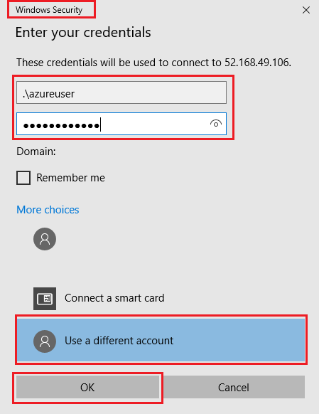

# 01 - Create a virtual machine in the portal

In this walkthrough, we will create a virtual machine in the Azure portal, connect to the virtual machine, install the web server role and test. 

**Note**: Take time during this walk-through to click and read the Informational icons. 

# Task 1: Create the virtual machine

In this task, we will create a Windows Server 2019 Datacenter - Gen1 virtual machine. 

1. Click on the Azure Portal icon on the VM desktop and login with the Azure credentials from the Lab Environment output page.

2. From the **All services** blade, search for and select **Virtual machines**, and then click **+ Add** and choose **+Virtual machine**.

3. On the **Basics** tab, fill in the following information (leave the defaults for everything else):

    | Settings | Values |
    |  -- | -- |
    | Subscription | **Choose your subscription**|
    | Resource group | **myRGVM-[DeploymentID]** (use existing) |
    | Virtual machine name | **myVm** |
    | Location | **(US) East US**|
    | Image | **Windows Server 2019 Datacenter - Gen1**|
    | Size | **Standard_D2s_v3**|
    | Administrator account username | **azureuser** |
    | Administrator account password | **Pa$$w0rd1234**|
    | Inbound port rules - Allow select ports | **RDP (3389)** and **HTTP (80)**|
    | | |

   > **Note** : DeploymentID can be obtained from the Lab Environment output page.

4. Switch to the Networking tab, and look for the **Select inbound ports**:

    | Settings | Values |
    | -- | -- |
    | Select inbound ports | **HTTP (80), RDP (3389)**|
    | | |

    **Note** - Verify that both port 80 and 3389 are selected

5. Switch to the Management tab, and in its **Monitoring** section, select the following setting:

    | Settings | Values |
    | -- | -- |
    | Boot diagnostics | **Disable**|
    | | |

6. Leave the remaining defaults and then click the **Review + create** button at the bottom of the page.

7. Once Validation is passed click the **Create** button. It can take anywhere from five to seven minutes to deploy the virtual machine.

8. You will receive updates on the deployment page and via the **Notifications** area (the bell icon in the top menu).

* **Verify Port 80 and 3389 were opened**

# Task 2: Connect to the virtual machine

In this task, we will connect to our new virtual machine using RDP. 

1. Search for **myVM** and select your new virtual machine.

    **Note**: You could also use the **Go to resource** link on the deployment page or the link to the resource in the **Notification** area.

2. On the virtual machine **Overview** blade, click the **Connect** button and choose **RDP**.

    

    **Note**: The following directions tell you how to connect to your VM from a Windows computer. On a Mac, you need an RDP client such as this Remote Desktop Client from the Mac App Store and on a Linux computer you can use an open source RDP client.

2. In the **Connect to virtual machine** page, keep the default options to connect with the public IP address over port 3389 and click **Download RDP File**.

3. **Open** the downloaded RDP file and click **Connect** when prompted. 

    

4. In the **Windows Security** window, select **More choices** and then **Use a different account**. Provide the username (.\azureuser) and the password (Pa$$w0rd1234). Click **OK** to connect.

    

5. You may receive a certificate warning during the sign-in process. Click **Yes** or to create the connection and connect to your deployed VM. You should connect successfully.

    

Congratulations! You have deployed and connected to a Windows Server virtual machine in Azure

